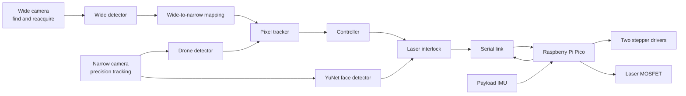

# Laser Turret

An experimental two-camera pan/tilt tracking platform that detects a handheld DGI drone, follows it with a differential stepper mechanism, and controls a low-power green laser through a deliberately fail-closed software interlock.

This README explains both the big picture and the implementation. In plain language: a Windows computer watches two cameras, identifies the drone, estimates where it is moving, and asks a Raspberry Pi Pico to turn two motors. The laser is a separate output. Tracking the drone does **not** automatically permit the laser to turn on; a set of additional checks must all pass on every control cycle.

## What is in this repository?

| Area | Purpose |
|---|---|
| `turret_host/` | Windows/Python application: cameras, object and face detection, tracking, motion control, GUI, calibration, logging, and serial communication |
| `firmware/current/` | Current MicroPython firmware for the Raspberry Pi Pico |
| `turret-2026-03-27_134819/` | KiCad schematic and PCB layout for controller board revision `3/27/2026 prod v1` |
| `tools/` | Calibration, deployment, diagnostics, replay, registration, and analysis utilities |
| `tests/` | Host-side regression tests, principally for telemetry and microstepping |
| `dataset/`, `models/`, `weights/` | Local training data and detector artifacts; most generated content is intentionally ignored by Git |
| `firmware/backups/` | Historical, timestamped firmware snapshots; useful for archaeology, not the current implementation |
| `staged/` | Proposed patches and experiments that may not be active |

The authoritative implementation paths are `turret_host/`, `firmware/current/`, and the KiCad project. Documents such as `AGENT_HANDOFF.md`, `DETECTION_BRIEF.md`, session notes, and staged patches preserve valuable history, but some statements in them have since been superseded by measurements or code changes.

## System overview

The physical head carries a narrow camera, a wide camera, a laser, and an inertial measurement unit (IMU). Two stepper motors drive a differential wrist. The computer performs the expensive vision and tracking work; the Pico generates accurate step pulses, applies motion limits, operates switched outputs, and stops motion if host commands disappear.



The design separates responsibilities:

- The **host computer** understands images, chooses a target, predicts motion, calculates motor rates, presents status, and decides whether the laser is permitted.
- The **Pico firmware** performs deterministic pulse generation, differential kinematics, acceleration limiting, travel guarding, output control, and a 400 ms command watchdog.
- The **PCB** connects power, the Pico, plug-in stepper drivers, motor and sensor headers, and three MOSFET-switched loads.

## How one frame becomes motion

1. Dedicated capture threads continuously grab the newest narrow and wide camera frames.
2. YOLO detects candidate drones. Wide-camera detections can help find a target outside the narrow field of view.
3. A stateful pixel tracker associates detections across frames and estimates position and velocity.
4. The controller compares the predicted target position with the calibrated laser aim point.
5. A measured image Jacobian converts the required image motion into signed rates for the two motors.
6. The host sends `vel <motor-a> <motor-b>` commands over USB serial.
7. The Pico ramps toward those rates and generates step pulses using RP2040 PIO hardware.
8. If new commands stop arriving for 400 ms, the firmware ramps the motors to zero and cuts the laser.

Instead of queues, threads exchange data through a `Slot`: a one-item, newest-wins mailbox. This is important for real-time behavior. If vision falls behind, processing an old queue of frames would make the turret chase where the target *was*. A slot lets a slow consumer skip frames and act on the freshest available observation.

## Computer vision and target tracking

### Two cameras, two roles

The **wide camera** provides situational awareness and reacquisition. It is an SVPRO USBFHD01M/OV2710 module with an approximately 108° horizontal field of view. It normally runs at 1920×1080 at 30 fps, with an optional 1280×720 at 60 fps mode.

The **narrow camera** is a Logitech C270 running at 1280×720 at 30 fps. It provides the precision image coordinate system used by the tracker, controller, laser calibration, and safety checks. It is physically mounted 90° clockwise and has had its IR-cut filter removed. That improves some sensing possibilities but shifts its colors away from what ordinary pretrained vision models expect.

The wide-to-narrow transformation can steer the turret toward a target seen only by the wide camera. It includes camera rotation, focal-length scaling, and optional fitted registration. However, parallax and calibration error mean a wide-origin box is never considered precise enough to authorize the laser. The design rule is:

> **Track on either camera; fire only from current narrow-camera evidence.**

### Drone detection

`turret_host/detector.py` wraps an Ultralytics YOLO detector. The active default is the project-specific `drone_y11n_v4_1280.pt`, run at 1280-pixel input size with FP16 enabled where supported. Only the `drone` class is selected.

The detector proposes boxes; it does not by itself decide which box to follow or whether the laser may operate. Training and capture utilities support collecting in-domain images, pre-labeling them, reviewing labels, and training a small model. This matters because the real scene—a close drone held in a hand, indoors, with partial occlusion and altered camera color response—is unlike the small outdoor drones found in most public datasets.

### Association and prediction

`turret_host/tracker.py` implements a pixel-space Kalman tracker with state:

```text
[horizontal position, vertical position, horizontal velocity, vertical velocity]
```

It uses confidence, spatial gating, box geometry, and continuity to associate detections. Adaptive process noise lets it remain smooth during steady motion while responding more quickly when the target changes direction. Its state machine is:

- `SEARCH`: no reliable target.
- `ACQUIRE`: a candidate is being confirmed.
- `TRACK`: the detector and filter agree on a target.
- `COAST`: detections were briefly lost, so the filter is predicting without fresh pixel evidence.

Coasting is useful for smooth pointing but is **not** sufficient permission to fire. The interlock requires a fresh narrow-camera drone box, not just a plausible prediction.

Range is estimated from apparent drone size when possible and may be supplemented by camera geometry. The assumed physical drone width is part of the configuration, so this is an estimate rather than a depth sensor measurement.

### Motion compensation and control

The controller combines two ideas:

- **Proportional correction** moves the target toward the goal pixel.
- **Feedforward** uses estimated target velocity so the turret moves with the target instead of always lagging behind it.

The core control law is conceptually:

```text
motor rate = - inverse(image Jacobian) × (position correction + target image velocity)
```

The image Jacobian is measured during calibration by moving the mechanism and observing how a stationary scene shifts in the camera. Its sign and scale are machine-specific. Rates are clamped, derated near travel limits, and converted through the differential mechanism. Optical flow and IMU-derived platform motion can improve the velocity estimate; their quality gates and fallbacks are logged so recorded runs can be analyzed rather than tuned by impression.

## How face protection works

The active face detector is OpenCV YuNet. It runs in a dedicated thread on the **narrow camera** because CPU inference can take longer than one camera frame period. YuNet expects upright faces, so the narrow image is rotated to compensate for the camera's 90° physical mounting. Detected boxes are then mapped back to the raw narrow-camera coordinate system used by tracking and control.

The interlock measures the distance between every detected face box and the intended beam path. The path is treated as a segment between the calibrated laser goal and current target location rather than as a single point. If a face is within the configured 120-pixel exclusion margin, the laser is inhibited.

Just as importantly, a missing or old face report is treated as **unknown**, not “no face.” A stalled detector, dead camera thread, clock error, or face result older than 200 ms therefore turns the laser off.

### The laser permission checklist

`LaserInterlock` grants permission only when **all** of the following are true:

| Check | Meaning |
|---|---|
| Armed | Both configuration and the operator's deliberate arm action allow laser use |
| Tracking | The tracker is in confirmed `TRACK`, not searching, acquiring, or coasting |
| Goal calibrated | The image location where the beam lands has been physically measured |
| Fresh drone lock | A recent narrow-camera drone box exists and contains the entire beam path |
| Plausible shape | The box aspect ratio is consistent with the measured drone, rejecting a known hand-like false positive |
| Fresh face report | The face detector has reported recently enough to be trusted |
| Face clear | Every face is farther than the inhibit margin from the beam path |
| Settled | The platform angular rate is below the firing threshold |
| Aim error small | The tracked target is close enough to the calibrated beam point |
| Velocity stream fresh | A motion command was successfully sent within the last 100 ms |
| Duty limit | Continuous on-time has not exceeded the configured cap; a cooldown follows a trip |

The logic is permission-based: a current drone detection under the beam is positive evidence. Merely failing to see a face is never enough. On any failed check, the desired laser state changes to off before normal motion work continues.

Additional protections include:

- Operator stop, disarm, E-stop, shutdown, and dead-worker events set a host-side **latched safety veto**. It can only be cleared by a new human arm action.
- Arming on real hardware invokes a live face-interlock verification procedure.
- A refused firmware `laser on` is not retried forever.
- The serial writer prioritizes laser state transitions and reports when a dead link makes software unable to confirm that the beam is off.
- Firmware boot and exception paths park STEP/DIR and all MOSFET gates low.
- The velocity watchdog cuts the laser as well as stopping motion.

### What this protection cannot guarantee

The software currently detects **visible faces**, not all human heads. YuNet can miss profiles, the back of a head, heavy occlusion, poor lighting, motion blur, or a strongly tilted face. The repository records a known loss around 35° of in-plane head tilt in one test configuration. The 200 ms allowable report age also permits real-world motion within the safety margin.

Only narrow-camera faces participate in the firing veto. Wide-camera face boxes are drawn for awareness but are not geometrically calibrated into the beam coordinate system and do not gate the laser.

No software command can switch off a laser after power or serial control has failed in a state that leaves the output energized. A physical, normally-off power interlock, keyed enable, emergency stop that removes laser power, enclosure/beam stop, and appropriate protective eyewear are outside this repository and remain necessary. Cheap 532 nm DPSS modules may also emit invisible infrared unless properly filtered.

## Firmware architecture

The firmware runs on a Raspberry Pi Pico/RP2040 under MicroPython.

| Module | Responsibility |
|---|---|
| `main.py` | Safe boot, pin parking, and console startup |
| `cli.py` | USB serial command protocol and operational workflows |
| `stepper.py` | PIO step generation, position moves, velocity loop, acceleration, watchdog, and optional microstep profiles |
| `kinematics.py` | Differential transform between motor motion and payload pitch/yaw |
| `guard.py` | IMU-backed crash/travel protection |
| `imu.py` | GY-85 gyro, accelerometer, and magnetometer drivers |
| `datum.py` | Gravity/yaw datum handling |
| `endstop.py` | Endstop debouncing, homing, and repeatability tests |
| `peripherals.py` | Laser, IR light, fan, ultrasonic, analog, and I²C devices with safety checks |
| `pinmap.py` | Copper-verified board wiring; the hardware source of truth |
| `config.py` | Driver type, mechanics, limits, interlocks, and timing |
| `diagnostics.py` | Electrical and motion self-tests |

The differential wrist is not a conventional independent pan motor plus tilt motor. Both motors moving in the same direction produce pitch; moving oppositely produces yaw. Each motor by itself produces a mixture. `kinematics.py` performs this transform using the 26-tooth motor and 60-tooth miter pulley ratio.

Position moves and continuous velocity mode use RP2040 PIO state machines for deterministic pulses. A 5 ms firmware velocity tick ramps rates and enforces limits. Dynamic microstepping exists but is disabled by default because measured switching disturbances outweighed its benefit on this drivetrain.

## PCB and hardware design

The KiCad design is a single controller/carrier board centered on:

- **A1 — Raspberry Pi Pico:** USB-connected control computer and I/O controller.
- **A2/A3 — Pololu-format stepper sockets:** intended symbol is DRV8825, while the installed/configured drivers are A4988-compatible modules.
- **U1 — XL1509-5.0 buck regulator:** creates the board's 5 V rail from the external motor supply, with L1, D1, and bulk capacitors.
- **Q1/Q2/Q4 — low-side N-channel MOSFET outputs:** switch the laser, IR illuminator, and fan.
- **J2/J3:** four-wire motor coil connectors.
- **J13/J14:** endstop connectors.
- **J5/J11:** sensor/I²C connections; the GY-85 is configured on J5/I²C0.
- **J10/J9/J7:** laser, IR, and fan switched-load connectors.

The Pico is USB-powered; the PCB's 5 V rail does not feed Pico `VSYS`. Grounds are common. This means the controller does not operate as a standalone board without USB power.

### GPIO summary

| Function | GPIO |
|---|---:|
| Tilt motor DIR / STEP | 0 / 1 |
| Tilt microstep M2/M1/M0 / enable | 2 / 3 / 4 / 5 |
| Tilt driver pad 2 | 6 |
| Pan motor DIR / STEP | 7 / 8 |
| Pan microstep M2/M1/M0 / enable | 9 / 10 / 11 / 12 |
| Pan driver pad 2 | 13 |
| IR / fan / endstop 1 / laser | 14 / 15 / 16 / 17 |
| Endstop 2 | 19 |
| J5 I²C0 SDA/SCL | 20 / 21 |
| J11 I²C1 SDA/SCL | 26 / 27 |
| Analog input | 28 / ADC2 |

### Important PCB findings and rework

These are facts encoded in `firmware/current/pinmap.py` and `config.py`, not generic warnings:

1. **Tilt STEP and DIR net labels are swapped in the schematic.** The copper is usable; firmware follows the physically verified GPIO0=DIR and GPIO1=STEP mapping.
2. **Driver socket pad 2 differs between DRV8825 and A4988.** It is `FAULT` on a DRV8825 but logic `VDD` on an A4988. The current configuration drives it from a Pico GPIO as an acknowledged, marginal workaround; the documented preferred rework is a proper 3.3 V connection.
3. **RESET/SLEEP is reportedly tied to 5 V.** This violates the A4988 input limit when its logic supply is 3.3 V and is explicitly recorded as an accepted out-of-spec condition, not a safe design recommendation.
4. **Several sensor connectors expose 5 V next to direct RP2040 inputs.** The ultrasonic echo, analog sensor return, and powered endstop arrangements have no divider or clamp. RP2040 GPIO is not 5 V tolerant; only dry-contact-to-ground endstops or verified 3.3 V signals are safe.
5. **The motor connectors are mirrored.** Each keeps a coil on adjacent pins, but supplied interleaved looms must be re-pinned so each coil occupies pins 1–2 or 3–4. Incorrect wiring can make a motor buzz and overheat its driver.
6. **The TO-220 MOSFET footprint pin order did not match a standard device.** Q1/Q2/Q4 require crossed gate/drain leads or a matching pinout. Current config says this rework was completed; verify the physical board.
7. **There are no on-board I²C pull-ups.** Any attached module must provide correctly referenced 3.3 V pull-ups.

For any new revision, these should be corrected in copper instead of perpetuated as assembly workarounds.

## Homing, calibration, and coordinate systems

The turret has multiple coordinate systems: wide pixels, raw narrow pixels, upright display pixels, motor microsteps, payload pitch/yaw, and the real laser spot. Calibration is what connects them.

At startup, the normal application establishes a repeatable datum by checking the link, calibrating gyro bias, leveling from gravity, finding a yaw reference, applying a consistent backlash preload, and setting home. Pitch is observable from gravity. Yaw is not; the project uses the repeatable magnetic field of the nearby motors as a local datum rather than trusting it as a compass.

Required calibration artifacts include:

- **Image Jacobian:** how motor steps move a stationary feature in the narrow image.
- **Goal pixel:** where the real laser spot lands in the narrow image. Frame center is acceptable for aiming experiments but never for firing permission.
- **Wide-to-narrow registration:** how a wide detection maps into the narrow camera for reacquisition.
- **Camera/latency measurements:** focal geometry, exposure, frame delivery, and end-to-end delay.

Mechanical backlash was measured around 0.57°, so homing approaches the final datum from a consistent direction.

## Running the software

The recorded development environment is Windows with Python 3.12, OpenCV, NumPy, Pillow, pyserial, PyTorch with CUDA, and Ultralytics. A `.venv` directory exists in this checkout, but virtual environments are machine-specific and its Python launcher may point to an interpreter that is no longer installed. The repository currently has no reproducible lock file; treat the environment description as informative rather than a clean-install guarantee, and rebuild the environment locally when necessary.

Start safely with simulation and no GUI:

```powershell
.\.venv\Scripts\python.exe -m turret_host.app --no-hardware --no-gui --run-seconds 5
```

Run simulation with the spectator GUI:

```powershell
.\.venv\Scripts\python.exe -m turret_host.app --no-hardware
```

Run with real cameras and motion but force tracking-only behavior:

```powershell
.\.venv\Scripts\python.exe -m turret_host.app --tracking-only
```

The real-hardware default performs homing and may move the mechanism. Keep the laser power physically disconnected during commissioning. Useful options include `--port`, `--cpu`, `--wide-fast`, `--fast-home`, `--skip-level`, `--record DIR`, and `--run-seconds N`; use `--help` for the current list.

## Verification and diagnostics

Tests that do not require attached hardware:

```powershell
.\.venv\Scripts\python.exe -m compileall -q turret_host
.\.venv\Scripts\python.exe -m unittest discover -s tests
.\.venv\Scripts\python.exe -m turret_host.control
.\.venv\Scripts\python.exe -m turret_host.tracker
```

Many utilities in `tools/` intentionally talk to real hardware or cameras. Read their arguments and source before running them. In particular, deployment, homing, calibration, step, lash, and structured-light tools can cause motion or light emission.

The application can record synchronized telemetry for after-action analysis. The supporting scripts study latency, clock alignment, step integrity, image registration, optical-flow velocity, aim residuals, and mechanical skew. This measurement-first approach is central to the project: motor counts alone cannot reveal a skipped belt or stalled mechanism, and a visually smooth demo does not prove that the safety gates worked.

## Known limitations and current status

- This working tree is an active prototype with uncommitted current-code changes and staged experiments.
- Laser enable is currently `True` in both `turret_host/config.py` and `firmware/current/config.py`. The GUI still requires deliberate arming and the interlock still applies, but configuration is not a physical safety barrier.
- Face detection is a safety aid with known blind spots, not proof that no head is present.
- Wide-camera detections can steer but cannot authorize firing.
- Several camera intrinsics and offsets began as estimates; verify which calibration JSON artifacts exist on the actual machine.
- Dead reckoning can diverge when motors skip. The payload accelerometer independently measures tilt, but it cannot directly observe yaw near level.
- The software soft limits do not replace mechanical stops. The payload is documented as ±90° pitch with a ±225° yaw wiring limit.
- The host presently caps normal motor commands at 1000 microsteps/s pending further delivery testing, below firmware's higher electrical ceiling.
- Hardware notes describe accepted out-of-spec wiring. A production revision should add real level shifting/protection and a hardware laser-interlock chain.

## Design principles worth preserving

- **Fail closed:** uncertainty removes permission; it never creates it.
- **Freshness is data:** every frame, face report, detection, and command carries time information.
- **Newest wins:** discard stale work instead of building a real-time backlog.
- **Measure geometry:** do not hide sign errors or physical offsets in tuning constants.
- **Separate tracking from firing:** a prediction may steer, but only current narrow-camera evidence can permit light.
- **Independent witnesses:** use camera evidence, serial freshness, IMU attitude, firmware watchdogs, and human controls for different failure modes.
- **Preserve provenance:** a mapped wide-camera box remembers that it came from the wide camera and can never accidentally become firing evidence.

## Further reading

- `turret_host/BUILD_SPEC.md` — host design contract and hard-won implementation constraints.
- `turret_host/STATUS.md` — an older formal safety review; useful history, but some configuration values are now outdated.
- `AGENT_HANDOFF.md` — detailed hardware measurements, firmware protocol, and project history.
- `DETECTION_BRIEF.md` — rationale for the custom drone dataset and detector training approach.
- `PLAN_NEXT_STAGE.md` and session notes — experimental results and next-stage control analysis.
- `firmware/current/pinmap.py` — the copper-verified wiring source of truth.

## Responsible use

This project combines automated aiming, moving machinery, exposed electronics, and laser emission. Operate it only in a controlled indoor test area with a beam stop, exclusion zone, direct supervision, and a physical means to remove laser power. Begin with the laser disconnected and substitute a harmless indicator during software development. Compliance with local laser, electrical, workplace, and aviation rules is the operator's responsibility.
